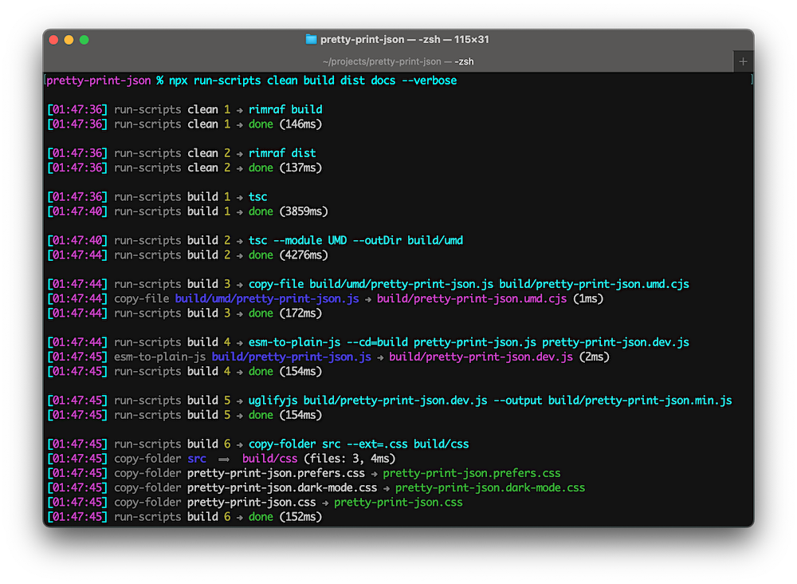

# run-scripts-util


_Organize npm scripts into named groups of easy to manage commands (CLI tool designed for use in npm scripts)_

[](https://github.com/center-key/run-scripts-util/blob/main/LICENSE.txt)
[](https://www.npmjs.com/package/run-scripts-util)
[](https://github.com/center-key/run-scripts-util/actions/workflows/run-spec-on-push.yaml)

**run-scripts-util** reads the `runScriptsConfig` settings in your **package.son** to get
groups (arrays) of commands to execute.

**Turn the traditional hard-to-follow commands:**
```json
"scripts": {
   "clean": "rimraf build dist",
   "compile-ts": "tsc",
   "compile-less": "lessc src/web-app/style.less build/web-app/style.css",
   "graphics": "copy-folder src/graphics build/my-app/graphics",
   "compile-html": "replacer src/web-app --ext=.html --pkg build/my-app",
   "pretest": "npm run clean && npm run compile-ts && npm run compile-less && npm run graphics && npm run compile-html",
   "test": "mocha spec"
},
```
**into easy-to-read named groups (arrays) of commands:**
```json
"runScriptsConfig": {
   "clean": [
      "rimraf build dist"
   ],
   "compile": [
      "tsc",
      "lessc src/web-app/style.less build/web-app/style.css",
      "copy-folder src/graphics build/my-app/graphics",
      "replacer src/web-app --ext=.html --pkg build/my-app"
   ]
},
"scripts": {
   "pretest": "run-scripts clean compile",
   "test": "mocha spec"
},
```
Each group of commands is executed in order, and the commands within each group are by default
executed in serial (synchronously) but can optionally be executed in parallel (asynchronously).



## A) Setup
Install package for node:
```shell
$ npm install --save-dev run-scripts-util
```

## B) Usage
### 1. npm scripts
Use `run-scripts` in the `"scripts"` section of your **package.json** file and add a
parameter naming the key in `runScriptsConfig` holding the group (array) of commands to
execute.

Example **package.json** scripts:
```json
   "scripts": {
      "build": "run-scripts clean compile",
   },
```

### 2. CLI flags
Command-line flags:
| Flag         | Description                                            | Value      |
| ------------ | ------------------------------------------------------ | ---------- |
| `--note`     | Place to add a comment only for humans.                | **string** |
| `--only`     | Execute just one command in the group (starts with 1). | **number** |
| `--parallel` | Execute all commands within each group asynchronously. | N/A        |
| `--quiet`    | Suppress informational messages.                       | N/A        |
| `--verbose`  | Add script group name to informational messages.       | N/A        |

### 3. Example CLI usage
Examples:
   - `run-scripts clean compile`<br>
   Execute the `clean` group of commands and then execute the `compile` group fo commands.

   - `run-scripts clean compile --quiet`<br>
   Do not display information messages.

   - `run-scripts compile --verbose --only=2`<br>
   Execute just the second command in the `compile` group.

   - `run-scripts lint watch --parallel`<br>
   Execute all the `lint` commands in parallel and after all the commands are finished execute
   the `watch` commands in parallel.

### 4. Skip a command
To _comment out_ a command prepend a dash (`-`) to the command.

In the example below, the first `tsc` command will be skipped while the `tsc --verbose` command will be executed:
 ```json
"runScriptsConfig": {
   "compile": [
      "- tsc",
      "tsc --verbose",
      "lessc src/web-app/style.less build/web-app/style.css"
   ]
}
```

### 5. Debug a command
To manually run a single command, use `npx` from the terminal plus the `--only` flag.

For example, to run the third command in the `compile` group by itself:
```shell
$ npx run-scripts compile --only=3
```

## C) Application Code
Even though **run-scripts-util** is primarily intended for build scripts, the package can easily be used programmatically in ESM and TypeScript projects.

Example:
``` typescript
import { runScripts } from 'run-scripts-util';

const options = { quiet: false };
runScripts.exec('compile', options);
runScripts.execParallel('watch', options);
```

See the **TypeScript Declarations** at the top of [run-scripts.ts](run-scripts.ts) for documentation.

<br>

---
**CLI Build Tools**
   - 🎋 [add-dist-header](https://github.com/center-key/add-dist-header):&nbsp; _Prepend a one-line banner comment (with license notice) to distribution files_
   - 📄 [copy-file-util](https://github.com/center-key/copy-file-util):&nbsp; _Copy or rename a file with optional package version number_
   - 📂 [copy-folder-util](https://github.com/center-key/copy-folder-util):&nbsp; _Recursively copy files from one folder to another folder_
   - 🪺 [recursive-exec](https://github.com/center-key/recursive-exec):&nbsp; _Run a command on each file in a folder and its subfolders_
   - 🔍 [replacer-util](https://github.com/center-key/replacer-util):&nbsp; _Find and replace strings or template outputs in text files_
   - 🔢 [rev-web-assets](https://github.com/center-key/rev-web-assets):&nbsp; _Revision web asset filenames with cache busting content hash fingerprints_
   - 🚆 [run-scripts-util](https://github.com/center-key/run-scripts-util):&nbsp; _Organize npm scripts into named groups of easy to manage commands_
   - 🚦 [w3c-html-validator](https://github.com/center-key/w3c-html-validator):&nbsp; _Check the markup validity of HTML files using the W3C validator_

Feel free to submit questions at:<br>
[github.com/center-key/run-scripts-util/issues](https://github.com/center-key/run-scripts-util/issues)

[MIT License](LICENSE.txt)
